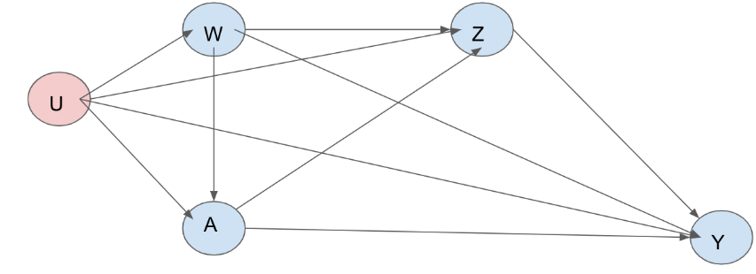

```{r setup, include=FALSE}
knitr::opts_chunk$set(echo = TRUE)
```

```{r,include=FALSE}
fhs = read.csv('framingham.csv', header = T)
head(fhs)
```

```{r,include=FALSE}
summary(fhs)
table(fhs$TenYearCHD)
table(fhs$currentSmoker)
table(fhs$cigsPerDay)
dim(fhs)
```
# Background Story

Coronary heart disease (CHD) is the leading cause of death and serious illness in the United States. The Framingham Heart Study's objective was to identify the common factors or characteristics that contribute to CHD by following its development over time in a large group of participants who had not yet developed overt symptoms of CHD or suffered a heart attack or stroke.


The researchers recruited 5,209 men and women between the ages of 30 and 70 from Framingham, Massachusetts, and began the first round of extensive physical examinations and lifestyle interviews that they would later analyze for common patterns related to CHD development. Over the years, careful monitoring of the Framingham Study population has led to the identification of the major CHD risk factors – high blood pressure, high blood cholesterol, smoking, obesity, diabetes, and physical inactivity. We are interested how the extent of smoking affects the development of CHD, specifically, it is not immediately obvious whether smoking 5 cigarettes per day affects the development of CHD differently than smoking 15 cigarettes per day does.

# Causal Roadmap

## Step 0: Specify the Scientific Question

What is the effect of smoking on the ten-year development of Coronary Heart Disease?

#### Target population 

The target population is white middle-class men and women aged 30 to 70 in the US. 


The sameple in this study is white middle-class men and women aged 30 to 70 (at baseline) in Framingham, Massachusetts. The importance of the major CHD risk factors identified in this group have been shown in other studies to apply almost universally, even though the patterns of distribution may vary. Thus, we are willing to generalize to the target population.

## Step 1: Specify a Causal Model


- Endogenous nodes: $X = (W,Z,A,Y)$, where 

- $W$ is age, gender,  education
- $Z$ is blood pressure (systolic and diastolic), total Cholesterol, prevalence of hypertension, prevalence of stroke, heart rate, BMI, Diabetes prevalence
- $A$ is the number of cigarettes smoked per days
- $Y$ is the ten-year development of coronary heart disease (CHD).

- Exogenous nodes: $U = (U_{W}, U_{Z}, U_A , U_Y) \sim \mathbb{P}_U$. We make no assumptions about the distribution $\mathbb{P}_U$.

- Structural equations $F$:
$$
\begin{aligned}
W1 &\leftarrow  f_{W}(U_{W})\\
Z &\leftarrow  f_{Z}(W,A,U_{Z})\\
A  &\leftarrow f_A(W,U_A)\\
Y  &\leftarrow f_Y(W,Z,A,U_Y)\\
\end{aligned}
$$

There are no exclusion restrictions or assumptions about functional form.

#### Causal Graph

# NEEDS TO BE FIXED!
```{r fig1, fig.align='center',fig.cap="Causal Graph for the SCM", echo=FALSE, out.width='50%'}

```

## Step 2: Counterfactuals & Causal Parameter

#### Causal Parameter
$${\Psi^*}^{i}(\mathbb{P}^*)=\mathbb{E}^*[Y_i]\ \ \ i\in \{1,2,3,4\}$$
where $i$ represent the bin of cigarettes smoked per day. $Y_i$ denotes the counterfactual outcome (the ten-year development of cardiovascular disease), if possibly contrary to fact, a person's number of cigarettes smoked per day is within $i^{th}$ bin. 

## Step 3. Specify your observed data and its link to the causal model

The dataset is adapted from Framingham Heart Study. We assume that Gender, Age, Education, and Number of Cigarettes per Day ($A$) were collected in a questionnaire at baseline. Then,  BMI, Diabetes Status, Prevalence of Stroke, Prevalence of Hypertension, Indication of Blood Pressure Medication, Total Cholesterol Level, Blood Pressure, and Heart Rate were all collected after the questionnaire at a doctor's office. Our outcome, Coronary Heart Disease, is collected at a 10-year follow up. Note that this is unlike the original study. We assume our observed data were generated by sampling $n$ from a system described by our structural causal model, so we have $n = 4211$ copies of $O\overset{i.i.d}\sim \mathbb{P}_O$. We place no restrictions on the statistical model $\mathcal{M}$, which is thereby non-parametric. BMI was binned using guidelines from the World Health Organization. Total Cholesterol was binned using guidelines from the National Heart, Lung and Blood Institute (NHLBI). Table 1 below shows the counts for each variable in each bin of the exposure, as well as a $\chi^2$-test of independence.

```{r, include = FALSE}
library(dplyr)

### REMOVE EXPOSURE AND OUTCOME NA
fhs_complete_cases <- fhs %>%  filter(!is.na(cigsPerDay),!is.na(TenYearCHD),!is.na(age),!is.na(education),!is.na(male))

```


```{r, include = FALSE}
library(mltools)

## initalize empty binned dataframe 
fhs_binned <- data.frame(i=1:nrow(fhs_complete_cases))

## cigsPerDay
fhs_binned$cigsPerDay <-bin_data(fhs_complete_cases$cigsPerDay,bins=c(0,1,10,20,max(fhs_complete_cases$cigsPerDay)), binType = "explicit")

## diabetes
fhs_binned$diabetes <- as.factor(fhs_complete_cases$diabetes)

## Stroke
fhs_binned$prevalentStroke <- as.factor(fhs_complete_cases$prevalentStroke)

## Hypertension
fhs_binned$prevalentHyp <- as.factor(fhs_complete_cases$prevalentHyp)


# Variables binned based on science!
## age
fhs_binned$age  <- bin_data(fhs_complete_cases$age, bins=4, binType = "quantile")

## education NA fix
fhs_binned$education  <- (fhs_complete_cases$education)

## making 1 BP var
fhs_binned$BP <- as.factor(ifelse(fhs_complete_cases$sysBP/fhs_complete_cases$diaBP < 128/80,0,1))

## total cholesterol
fhs_binned$totChol  <- bin_data(fhs_complete_cases$totChol, bins=c(0,200,240,max(fhs_complete_cases$totChol, na.rm = T)), binType = "explicit")

## gender
fhs_binned$gender  <-factor(fhs_complete_cases$male)

## BMI NA fix
fhs_binned$bmi  <- bin_data(fhs_complete_cases$BMI, bins=c(0,18.5,25,30,max(fhs$BMI, na.rm = T)), binType = "explicit")

## technically don't need this...
fhs_binned$glucose  <- bin_data(fhs_complete_cases$glucose, bins=c(0,78,max(fhs$glucose, na.rm = T)), binType = "explicit")

## heart rate
fhs_binned$heartRate  <- bin_data(fhs_complete_cases$heartRate, 
                                  bins=c(0,60,max(fhs_complete_cases$heartRate, na.rm = T)), 
                                  binType = "explicit")

## CHD
fhs_binned$CHD <- factor(fhs_complete_cases$TenYearCHD)

## remove index created 
fhs_binned <- subset(fhs_binned, select = -c(i))

## remove glucose
fhs_binned = fhs_binned[,-11]
```


```{r table1, echo=FALSE, warning=FALSE, message=FALSE}
library(tableone)
library(knitr)

tab = print(CreateTableOne(data = fhs_binned, factorVars = c("education"),strata = c("cigsPerDay")),
            showAllLevels = T, printToggle = F)
table1 = tab[-c(2:5),-ncol(tab)]
colnames(table1) = c("Level","[0,1)", "[1,10)", "[10,19)", "[20,70]", "p")

kable(table1, caption = "Number of Observations in Each Bin")
```


## Step 4. Identifiability

Since we made no independence assumptions on our exogenous background factors, we will need to make additional independence assumptions for identifiability. For the target causal parameter in the SCM $\mathcal{M^*}$ to be identified from the observed data distribution, we need to make a randomization and a positivity assumption. 


#### 1) Randomization Assumption:

Conditional on $W$, the counterfactual outcome is independent of the observed treatment: 
$$ Y \perp  A|W$$
```{r figc, fig.align='center',fig.cap="Causal Graph for the SCM", echo=FALSE,out.width='50%'}
knitr::include_graphics("./dags/augmented_dag.PNG")
```

$$U_A\perp U_Y,U_A\perp U_W,U_A\perp U_Z$$

In this augmented/working SCM ($\mathcal{M^{**}}$), the unmeasured background factor of $A$ (cigarettes smoked per day) is independent of the unmeasured background factor of $Y$ (10yr CHD), the unmeasured background factor of $W$ (baseline age, gender, education, diabetes, BMI), and the unmeasured background factor of $Z$ (prevalence of stroke, hypertension, blood pressure, blood pressure medication, heart rate).

Since $W$,$Z$, and $Y$ include SES and biological factors that affect human health, we aviod assuming independence between their unmeasured background factors. Thus, we consider it is more plausible to make the indepedence assumptions listed. We do not the mediator $Z$ to avoid opening a backdoor path. Under $M^**$, the backdoor criterion holds conditional on $W$. Additional data on factors that affect heath status and determinants could help with identifiability, but those factors are not well-understood. 

#### 2) Positivity Assumption:

There must be a positive probability of each treatment condition within each possible strata of $W$. We need a positive probability of cigarettes smoked per day for each strata of $W$.
```{r,include=FALSE}
require(nnet)
# table for positivity
#table(fhs_binned[,c('age', 'education', 'gender','cigsPerDay')])
# check propensity scores

### Create pairwise binary variables for each bin
fhs_binned$cigsPerDay_bin_1 <- ifelse(fhs_binned$cigsPerDay == "[0, 1)",1,0)
fhs_binned$cigsPerDay_bin_2 <- ifelse(fhs_binned$cigsPerDay == "[1, 10)",1,0)
fhs_binned$cigsPerDay_bin_3 <- ifelse(fhs_binned$cigsPerDay == "[10, 20)",1,0)
fhs_binned$cigsPerDay_bin_4 <- ifelse(fhs_binned$cigsPerDay == "[20, 70]",1,0)

### BIN 1
bin1ps <- glm( cigsPerDay_bin_1 ~  gender + education + age, data = fhs_binned, family = "binomial")
ps1 <- predict(bin1ps, type= "response")
ps1sum = summary(ps1)

### BIN 2
bin2ps <- glm( cigsPerDay_bin_2 ~  gender + education + age, data = fhs_binned, family = "binomial")
ps2 <- predict(bin2ps, type= "response")
ps2sum = summary(ps2)

### BIN 3
bin3ps <- glm( cigsPerDay_bin_3 ~ gender + education + age, data = fhs_binned, family = "binomial")
ps3 <- predict(bin3ps, type= "response")
ps3sum = summary(ps3)

### BIN 4
bin4ps <- glm( cigsPerDay_bin_4 ~  gender + education + age, data = fhs_binned, family = "binomial")
ps4 <- predict(bin4ps, type= "response")
ps4sum = summary(ps4)

full_sum = rbind.data.frame(ps1sum,ps2sum,ps3sum,ps4sum)

row.names(full_sum) = c("i=1", "i=2", "i=3", "i=4")


```

$$
\begin{aligned}
min_{i\in A}\mathbb{P}_0(A=i|W=w)>0\\
\text{for all}\ w \ \text{for which} 
\mathbb{P}_0(W = w) \geq 0
\end{aligned}
$$
where $i$ denote the index of a bin of $A$.

# THIS NEEDS TO BE FIXED!!!!

We are concerned about a positivity assumption violation for a bin with high numbers of cigarettes smoked per day since certain strata of $W$ might not smoke at all, and binning could make particular stratas have low probabilities of smoking certain numbers of cigarettes per day. We can informally check for a positivity assumption violation from tables of $A$ given a strata of $W$. One table from a strata of $W$ is shown below:

\begin{table}[ht]
\centering
\caption{Table for BMI = [18.5, 25), Gender = 0, Diabetes = 0, A = 0 }
\small
\begin{tabular}{|l|l|l|l|l|l|}
\hline
Strata & Education: 1 & Education: 2 & Education: 3 & Education: 4 & Education: NA \\ \hline
Age: [32, 42) & 26 & 60 & 32 & 12 &  1 \\ \hline
Age: [42, 49) & 40 & 42 & 41 & 18 &  0 \\ \hline
Age: [49, 56) & 43 & 52 & 42 & 17 &  5  \\ \hline
Age: [56, 70] & 75 & 41 & 36 & 16 &  2  \\ \hline
\end{tabular}
\end{table} 

From the table above, we can see that we have 0 female whose BMI is in the range [18.5, 25), age is in the range of [42, 49), education level is missing, who does not have Diabetes, who does not smoke cigarettes. Thus, we have a sparsity issue. 

# NEED TO FIX ABOVE!!!!

We also calculated the predicted probability of each bin of $A$ (the number of cigarettes smoked per day) given a strata of $W$:

```{r, echo=FALSE, message=FALSE,warning=FALSE}
kable(full_sum, caption = "Predicted Probabilities of CHD for each Strata of W")
```


From the table, we can see that the probabiliy of falling into the last bin of $A$, which is $\geq 20$ cigarettes smoked per day, is very close to zero, indicating a practical violation of positivity assumption. Theoretically, randomizing the number of cigarettes smoked per day could help with identifiability, but it is not feasible.

## Step 5. Statistical Model and Estimand

The target parameter of $\mathbb{P}_0$, which equals the causal parameter in the augmented causal model $\mathcal{M}^{**}$ is given by the G-Computation formula:


$$
\begin{aligned}
\Psi_0(\mathbb{P}^i_0)&=\mathbb{E}_0[\mathbb{E}_0[Y|A= i,W=w]]\\
&= \sum_w\mathbb{E}_0[Y|A=i,W=w]*\mathbb{P}_0(W=w)
\end{aligned}
$$


## Step 6. Estimation

### Conditional Mean outcome 

```{r}
library(mgcv)

n_bootstrap_samples <-10
conMean_bootstrap <- matrix(NA, nrow=n_bootstrap_samples,ncol=4)

for(i in 1:n_bootstrap_samples){
  set.seed(i)
  fhs_binned_sample <- fhs_binned[sample(1:nrow(fhs_binned),nrow(fhs_binned),replace=TRUE),]
  
  intervene_on_bin <- function(i){
  fhs_binned_i <- fhs_binned_sample
  fhs_binned_i$cigsPerDay <-levels(fhs_binned_sample$cigsPerDay)[i]
  return (fhs_binned_i)
}


  
## SATURED REGRESSION MODEL FOR NPMLE
glm_fit <- glm( CHD ~ cigsPerDay*education*age*gender, data = fhs_binned_sample, family = "binomial")

for (j in 1:length(levels(fhs_binned$cigsPerDay))){
  conMean_bootstrap[i,j] <- mean(predict(glm_fit, newdata=intervene_on_bin(j), type='response'))
}
}

average_treatment_effect <- c()
average_treatment_effect_ci <- matrix(NA,nrow=length(levels(fhs_binned_sample$cigsPerDay)),ncol=2)
for (i in 1:length(levels(fhs_binned_sample$cigsPerDay))){
  average_treatment_effect[i] <- colMeans(conMean_bootstrap)[i]
  average_treatment_effect_ci[i,] <- quantile(conMean_bootstrap[,i],probs=c(.025,.975))

}

plot(average_treatment_effect,ylab="Probability of CHD",ylim=c(0,.5),
     main = "Simple Substitution")
points(average_treatment_effect_ci[,1],col='red',lty=2)
points(average_treatment_effect_ci[,2],col='red',lty=2)
```

### IPTW
```{r}

n_bootstrap_samples <-10
iptw_bootstrap <- matrix(NA, nrow=n_bootstrap_samples,ncol=4)

for (i in 1:n_bootstrap_samples){
  set.seed(i)
  fhs_binned_sample <- fhs_binned[sample(1:nrow(fhs_binned),nrow(fhs_binned),replace=TRUE),]

### BIN 1
glm_fit_iptw_bin_1 <- glm( cigsPerDay_bin_1 ~   education + age + gender, data = fhs_binned_sample, family = "binomial")
prob.1W <- predict(glm_fit_iptw_bin_1, type= "response")
wt_1<- 1/prob.1W
summary(wt_1)
IPTW_bin_1<- mean( wt_1*as.numeric(fhs_binned_sample$cigsPerDay_bin_1==1)*as.numeric(fhs_binned_sample$CHD==1))


### BIN 2
glm_fit_iptw_bin_2 <- glm( cigsPerDay_bin_2 ~   education + age + gender, data = fhs_binned_sample, family = "binomial")
prob.1W <- predict(glm_fit_iptw_bin_2, type= "response")
wt_2<- 1/prob.1W
summary(wt_2)
IPTW_bin_2<- mean( wt_2*as.numeric(fhs_binned_sample$cigsPerDay_bin_2==1)*as.numeric(fhs_binned_sample$CHD==1))

### BIN 3
glm_fit_iptw_bin_3 <- glm( cigsPerDay_bin_3 ~  education + age + gender, data = fhs_binned_sample, family = "binomial")
prob.1W <- predict(glm_fit_iptw_bin_3, type= "response")
wt_3<- 1/prob.1W
summary(wt_3)
IPTW_bin_3<- mean( wt_3*as.numeric(fhs_binned_sample$cigsPerDay_bin_3==1)*as.numeric(fhs_binned_sample$CHD==1))


### BIN 4
glm_fit_iptw_bin_4 <- glm( cigsPerDay_bin_4 ~  education + age + gender, data = fhs_binned_sample, family = "binomial")
prob.1W <- predict(glm_fit_iptw_bin_4, type= "response")
wt_4<- 1/prob.1W
summary(wt_4)
IPTW_bin_4<- mean( wt_4*as.numeric(fhs_binned_sample$cigsPerDay_bin_4==1)*as.numeric(fhs_binned_sample$CHD==1))

iptw_bootstrap[i,] = c(IPTW_bin_1, IPTW_bin_2, IPTW_bin_3, IPTW_bin_4)
}

average_treatment_effect <- c()
average_treatment_effect_ci <- matrix(NA,nrow=length(levels(fhs_binned_sample$cigsPerDay)),ncol=2)
for (i in 1:length(levels(fhs_binned_sample$cigsPerDay))){
  average_treatment_effect[i] <- colMeans(iptw_bootstrap)[i]
  average_treatment_effect_ci[i,] <- quantile(iptw_bootstrap[,i],probs=c(.025,.975))

}

plot(average_treatment_effect,ylab="Probability of CHD",ylim=c(0,.5),
     main = "IPTW")
points(average_treatment_effect_ci[,1],col='red',lty=2)
points(average_treatment_effect_ci[,2],col='red',lty=2)

```


### Superlearner/TMLE

```{r}

library('SuperLearner')
SL.library<- c("SL.glmnet","SL.randomForest","SL.nnet","SL.earth","SL.bayesglm")

n_bootstrap_samples <-100
tmle_bootstrap_bin_1 <- c()

for (i in 1:n_bootstrap_samples){
  set.seed(i)
  ### BIN1 TMLE
  fhs_binned_sample <- fhs_binned[sample(1:nrow(fhs_binned),nrow(fhs_binned),replace=TRUE),]
  
  X_minus_bin_1<- subset(fhs_binned_sample, select= c("cigsPerDay_bin_1", "education", "age","gender") )
  X_minus_bin_1$age <- as.numeric(X_minus_bin_1$age)
  X_minus_bin_1_all_bin_1 <- X_minus_bin_1
  X_minus_bin_1_all_bin_1$cigsPerDay_bin_1 <- 1
  
  ##CONVERT FACTORS TO NUMERIC FOR SUPERLEARNER
  
  
  SL.outcome<- SuperLearner(Y=as.numeric(fhs_binned_sample$CHD==1), X=X_minus_bin_1, SL.library=SL.library, family="binomial")
  
  
  expY.givenA1 <-  predict(SL.outcome, newdata=X_minus_bin_1_all_bin_1)$pred
  SL.exposure<- SuperLearner(Y=as.numeric(fhs_binned$cigsPerDay_bin_1==1), X=subset(X_minus_bin_1, select= -c(cigsPerDay_bin_1)),SL.library=SL.library, family="binomial")
  probA1.givenW<- SL.exposure$SL.predict
  H.AW<- as.numeric(fhs_binned$cigsPerDay_bin_1==1)/probA1.givenW
  logitUpdate<- glm(fhs_binned$CHD ~ -1 +offset(qlogis(expY.givenA1)) + H.AW, family='binomial')
  epsilon<- logitUpdate$coef
  expY.givenAW.star<- plogis(qlogis(expY.givenA1)+ epsilon*H.AW)
  PsiHat.TMLE_bin_1<- mean(expY.givenAW.star)#- expY.given0W.star)
  tmle_bootstrap_bin_1[i] <- PsiHat.TMLE_bin_1
}
```


```{r}
  #### BIN 2 TMLE

tmle_bootstrap_bin_2 <- c()
for (i in 1:n_bootstrap_samples){
  set.seed(i)
  X_minus_bin_2<- subset(fhs_binned_sample, select= c("cigsPerDay_bin_2", "education", "age","gender") )
  X_minus_bin_2$age <- as.numeric(X_minus_bin_2$age)
  X_minus_bin_2_all_bin_2 <- X_minus_bin_2
  X_minus_bin_2_all_bin_2$cigsPerDay_bin_2 <- 1
  
  SL.outcome<- SuperLearner(Y=as.numeric(fhs_binned_sample$CHD==1), X=X_minus_bin_2, SL.library=SL.library, family="binomial")
  expY.givenA1 <-  predict(SL.outcome, newdata=X_minus_bin_2_all_bin_2)$pred
  SL.exposure<- SuperLearner(Y=as.numeric(fhs_binned$cigsPerDay_bin_2==1), X=subset(X_minus_bin_2, select= -c(cigsPerDay_bin_2)),SL.library=SL.library, family="binomial")
  probA1.givenW<- SL.exposure$SL.predict
  H.AW<- as.numeric(fhs_binned$cigsPerDay_bin_2==1)/probA1.givenW
  logitUpdate<- glm(fhs_binned$CHD ~ -1 +offset(qlogis(expY.givenA1)) + H.AW, family='binomial')
  epsilon<- logitUpdate$coef
  expY.givenAW.star<- plogis(qlogis(expY.givenA1)+ epsilon*H.AW)
  PsiHat.TMLE_bin_2<- mean(expY.givenAW.star)#- expY.given0W.star)
  tmle_bootstrap_bin_2[i] <- PsiHat.TMLE_bin_2
}
```


```{r}

tmle_bootstrap_bin_3 <- c()
for (i in 1:n_bootstrap_samples){
  #### BIN 3 TMLE 
  
  X_minus_bin_3<- subset(fhs_binned_sample, select= c("cigsPerDay_bin_3", "education", "age","gender") )
  X_minus_bin_3$age <- as.numeric(X_minus_bin_3$age)
  
  X_minus_bin_3_all_bin_3 <- X_minus_bin_3
  X_minus_bin_3_all_bin_3$cigsPerDay_bin_3 <- 1
  SL.outcome<- SuperLearner(Y=as.numeric(fhs_binned_sample$CHD==1), X=X_minus_bin_3, SL.library=SL.library, family="binomial")
  expY.givenA1 <-  predict(SL.outcome, newdata=X_minus_bin_3_all_bin_3)$pred
  SL.exposure<- SuperLearner(Y=as.numeric(fhs_binned$cigsPerDay_bin_3==1), X=subset(X_minus_bin_3, select= -c(cigsPerDay_bin_3)),SL.library=SL.library, family="binomial")
  probA1.givenW<- SL.exposure$SL.predict
  H.AW<- as.numeric(fhs_binned$cigsPerDay_bin_3==1)/probA1.givenW
  logitUpdate<- glm(fhs_binned$CHD ~ -1 +offset(qlogis(expY.givenA1)) + H.AW, family='binomial')
  epsilon<- logitUpdate$coef
  expY.givenAW.star<- plogis(qlogis(expY.givenA1)+ epsilon*H.AW)
  PsiHat.TMLE_bin_3 <- mean(expY.givenAW.star)
  tmle_bootstrap_bin_3[i] <- PsiHat.TMLE_bin_3
```
  
  
```{r}
  #### BIN 4  TMLE 
tmle_bootstrap_bin_4 <- c()
for (i in 1:n_bootstrap_samples){

  X_minus_bin_4<- subset(fhs_binned_sample, select= c("cigsPerDay_bin_4", "education", "age","gender") )
  X_minus_bin_4$age <- as.numeric(X_minus_bin_4$age)
  
  X_minus_bin_4_all_bin_4 <- X_minus_bin_4
  X_minus_bin_4_all_bin_4$cigsPerDay_bin_4 <- 1
  SL.outcome<- SuperLearner(Y=as.numeric(fhs_binned_sample$CHD==1), X=X_minus_bin_4, SL.library=SL.library, family="binomial")
  expY.givenA1 <-  predict(SL.outcome, newdata=X_minus_bin_4_all_bin_4)$pred
  SL.exposure<- SuperLearner(Y=as.numeric(fhs_binned$cigsPerDay_bin_4==1), X=subset(X_minus_bin_4, select= -c(cigsPerDay_bin_4)),SL.library=SL.library, family="binomial")
  probA1.givenW<- SL.exposure$SL.predict
  H.AW<- as.numeric(fhs_binned$cigsPerDay_bin_4==1)/probA1.givenW
  logitUpdate<- glm(fhs_binned$CHD ~ -1 +offset(qlogis(expY.givenA1)) + H.AW, family='binomial')
  epsilon<- logitUpdate$coef
  expY.givenAW.star<- plogis(qlogis(expY.givenA1)+ epsilon*H.AW)
  PsiHat.TMLE_bin_4 <- mean(expY.givenAW.star)
  tmle_bootstrap_bin_4[i] <- PsiHat.TMLE_bin_4
}
```


```{r}

average_treatment_effect <- c()
average_treatment_effect_ci <- matrix(NA,nrow=length(levels(fhs_binned$cigsPerDay)),ncol=2)
for (i in 1:length(levels(fhs_binned$cigsPerDay))){
  average_treatment_effect[i] <- colMeans(tmle_bootstrap)[i]
  average_treatment_effect_ci[i,] <- quantile(tmle_bootstrap[,i],probs=c(.025,.975))

}

plot(average_treatment_effect,ylab="Probability of CHD",ylim=c(0,.5),
     main = "TMLE")
points(average_treatment_effect_ci[,1],col='red',lty=2)
points(average_treatment_effect_ci[,2],col='red',lty=2)

```

## Step 7. Result Interpretation

What is the statistical interpretation of your analyses? Discuss differences (or lack thereof) in the estimates provided by the different estimators. What is the causal interpretation of your results and how plausible is it? What are key limitations of your analysis? How might these results (if at all) inform policy, understanding, and/or the design of future studies?


```{r}

mean(as.numeric(fhs_binned[fhs_binned$cigsPerDay == "[10, 20)" & fhs_binned$age == "[32, 42)",]$CHD)-1)

mean(as.numeric(fhs_binned[fhs_binned$cigsPerDay == "[0, 1)" & fhs_binned$age == "[32, 42)",]$CHD)-1)

mean(as.numeric(fhs_binned[fhs_binned$cigsPerDay == "[1, 10)" & fhs_binned$age == "[56, 70]",]$CHD)-1)

mean(as.numeric(fhs_binned[fhs_binned$cigsPerDay == "[10, 20)" & fhs_binned$age == "[56, 70]",]$CHD)-1)
```

\newpage

## Team Member Contribution
<!-- Feel free to add more tasks for switch things around here, these are placeholders!-->

### Michael Attah
\begin{itemize}
\item Causal graph
\item Causal question
\item Estimation...
\item Interpretation?
\item etc
\end{itemize}

### Bianca Doone
\begin{itemize}

\item Bootstrap confidence interval
\item Data Retrieval 
\item Causal graph
\item Causal question
\item Causal Parameter
\item Specify observed data and link to SCM
\item Descriptive table
\item Put together Table 1

\end{itemize}

### Casey Graham

\begin{itemize}
\item  Categorize covariates 
\item  Causal Parameter
\item  Conditional mean outcome
\item  IPTW
\item  Superlearner/TMLE
\item  Causal graph
\item  Causal question
\item  Statistical Estimand: G-comp
\item  etc

\end{itemize}

### Daniel Saunders

\begin{itemize}
\item  Data exploration
\item  Estimation...
\item  Interpretation?
\item  Causal graph
\item  Causal question
\item  etc

\end{itemize}

### Nutcha Wattanachit
\begin{itemize}
\item  Background story 
\item  Descriptive table
\item  Causal graph
\item  Causal question
\item  Causal Parameter
\item  Specify observed data and link to SCM
\item  Identifiability: Randomization assumption
\item  Identifiability: Positivity assumption
\item  Statistical Estimand: G-comp

\end{itemize}


## References

Boston University & the National Heart, Lung, & Blood Institute, Framingham Heart Study. 5 Dec. 2018: https://www.framinghamheartstudy.org
