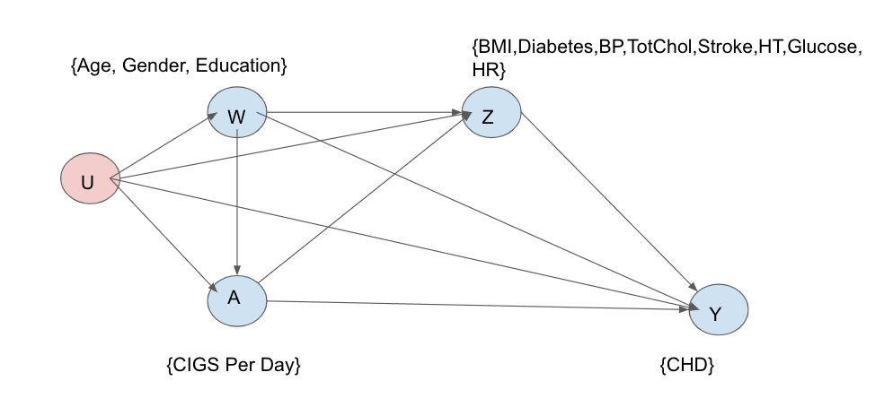

```{r setup, include=FALSE}
knitr::opts_chunk$set(fig.pos = "H",warning = FALSE,message = FALSE)
```

```{r,include=FALSE}
fhs = read.csv('framingham.csv', header = T)
head(fhs)
```

```{r,include=FALSE}
summary(fhs)
table(fhs$TenYearCHD)
table(fhs$currentSmoker)
table(fhs$cigsPerDay)
dim(fhs)
```
# Background Story

Coronary heart disease (CHD) is the leading cause of death and serious illness in the United States. The Framingham Heart Study's objective was to identify the common factors or characteristics that contribute to CHD by following its development over time in a large group of participants who had not yet developed overt symptoms of CHD or suffered a heart attack or stroke.

The researchers recruited 5,209 men and women between the ages of 30 and 70 from Framingham, Massachusetts, and began the first round of extensive physical examinations and lifestyle interviews that they would later analyze for common patterns related to CHD development. Over the years, careful monitoring of the Framingham Study population has led to the identification of the major CHD risk factors – high blood pressure, high blood cholesterol, smoking, obesity, diabetes, and physical inactivity. We are interested how the extent of smoking affects the development of CHD, specifically, it is not immediately obvious whether smoking 5 cigarettes per day affects the development of CHD differently than smoking 15 cigarettes per day does.

# Causal Roadmap

## Step 0: Specify the Scientific Question

What is the effect of smoking on the ten-year development of Coronary Heart Disease?

#### Target population 

The target population is white middle-class men and women aged 30 to 70 in the US. 

The sameple in this study is white middle-class men and women aged 30 to 70 (at baseline) in Framingham, Massachusetts. The importance of the major CHD risk factors identified in this group have been shown in other studies to apply almost universally, even though the patterns of distribution may vary. Thus, we are willing to generalize to the target population.

## Step 1: Specify a Causal Model

- Endogenous nodes: $X = (W,Z,A,Y)$, where 

- $W$ is age, gender,  education
- $Z$ is blood pressure (systolic and diastolic), total Cholesterol, prevalence of hypertension, prevalence of stroke, heart rate, BMI, Diabetes prevalence
- $A$ is the number of cigarettes smoked per days
- $Y$ is the ten-year development of coronary heart disease (CHD).

- Exogenous nodes: $U = (U_{W}, U_{Z}, U_A , U_Y) \sim \mathbb{P}_U$. We make no assumptions about the distribution $\mathbb{P}_U$.

- Structural equations $F$:
$$
\begin{aligned}
W &\leftarrow  f_W (U_W) \\
Z  &\leftarrow  f_Z (W, A, U_Z) \\
A  &\leftarrow  f_A (W, U_A) \\
Y  &\leftarrow  f_Y (W, Z, A, U_Y) \\
\end{aligned}
$$

There are no exclusion restrictions or assumptions about functional form.

#### Causal Graph

```{r fig1, fig.align='center',fig.cap="Causal Graph for the SCM", echo=FALSE, out.width='90%'}

```

## Step 2: Counterfactuals & Causal Parameter

#### Causal Parameter
$${\Psi^*}^{i}(\mathbb{P}^*)=\mathbb{E}^*[Y_i]\ \ \ i\in \{1,2,3,4\}$$
where $i$ represent the bin of cigarettes smoked per day. $Y_i$ denotes the counterfactual outcome (the ten-year development of cardiovascular disease), if possibly contrary to fact, a person's number of cigarettes smoked per day is within $i^{th}$ bin. 

## Step 3. Specify your observed data and its link to the causal model

The dataset is adapted from Framingham Heart Study. We assume that Gender, Age, Education, and Number of Cigarettes per Day ($A$) were collected in a questionnaire at baseline. Then,  BMI, Diabetes Status, Prevalence of Stroke, Prevalence of Hypertension, Indication of Blood Pressure Medication, Total Cholesterol Level, Blood Pressure, and Heart Rate were all collected after the questionnaire at a doctor's office. Our outcome, Coronary Heart Disease, is collected at a 10-year follow up. Note that this is unlike the original study. We assume our observed data were generated by sampling $n$ from a system described by our structural causal model, so we have $n = 4211$ copies of $O\overset{i.i.d}\sim \mathbb{P}_O$. We place no restrictions on the statistical model $\mathcal{M}$, which is thereby non-parametric. BMI was binned using guidelines from the World Health Organization. Total Cholesterol was binned using guidelines from the National Heart, Lung and Blood Institute (NHLBI). Table 1 below shows the counts for each variable in each bin of the exposure, as well as a $\chi^2$-test of independence.

```{r, include = FALSE}
library(dplyr)

### REMOVE EXPOSURE AND OUTCOME NA
fhs_complete_cases <- fhs %>%  filter(!is.na(cigsPerDay),!is.na(TenYearCHD),!is.na(age),!is.na(education),!is.na(male))
```


```{r, include = FALSE}
library(mltools)

## initalize empty binned dataframe 
fhs_binned <- data.frame(i=1:nrow(fhs_complete_cases))

## cigsPerDay
fhs_binned$cigsPerDay <-bin_data(fhs_complete_cases$cigsPerDay,bins=c(0,1,10,20,max(fhs_complete_cases$cigsPerDay)), binType = "explicit")

## diabetes
fhs_binned$diabetes <- as.factor(fhs_complete_cases$diabetes)

## Stroke
fhs_binned$prevalentStroke <- as.factor(fhs_complete_cases$prevalentStroke)

## Hypertension
fhs_binned$prevalentHyp <- as.factor(fhs_complete_cases$prevalentHyp)

# Variables binned based on science!
## age
fhs_binned$age  <- bin_data(fhs_complete_cases$age, bins=4, binType = "quantile")

## education NA fix
fhs_binned$education  <- (fhs_complete_cases$education)

## making 1 BP var
fhs_binned$BP <- as.factor(ifelse(fhs_complete_cases$sysBP/fhs_complete_cases$diaBP < 128/80,0,1))

## total cholesterol
fhs_binned$totChol  <- bin_data(fhs_complete_cases$totChol, bins=c(0,200,240,max(fhs_complete_cases$totChol, na.rm = T)), binType = "explicit")

## gender
fhs_binned$gender  <-factor(fhs_complete_cases$male)

## BMI NA fix
fhs_binned$bmi  <- bin_data(fhs_complete_cases$BMI, bins=c(0,18.5,25,30,max(fhs$BMI, na.rm = T)), binType = "explicit")

## technically don't need this...
fhs_binned$glucose  <- bin_data(fhs_complete_cases$glucose, bins=c(0,78,max(fhs$glucose, na.rm = T)), binType = "explicit")

## heart rate
fhs_binned$heartRate  <- bin_data(fhs_complete_cases$heartRate, 
                                  bins=c(0,60,max(fhs_complete_cases$heartRate, na.rm = T)), 
                                  binType = "explicit")

## CHD
fhs_binned$CHD <- factor(fhs_complete_cases$TenYearCHD)

## remove index created 
fhs_binned <- subset(fhs_binned, select = -c(i))

## remove glucose
fhs_binned = fhs_binned[,-11]
```


```{r table1, echo=FALSE, warning=FALSE, message=FALSE}
library(tableone)
library(knitr)

tab = print(CreateTableOne(data = fhs_binned, factorVars = c("education"),strata = c("cigsPerDay")),
            showAllLevels = T, printToggle = F)
table1 = tab[-c(2:5),-ncol(tab)]
colnames(table1) = c("Level","[0,1)", "[1,10)", "[10,19)", "[20,70]", "p")

kable(table1, caption = "Number of Observations in Each Bin")
```

## Step 4. Identifiability

Since we made no independence assumptions on our exogenous background factors, we will need to make additional independence assumptions for identifiability. For the target causal parameter in the SCM $\mathcal{M^*}$ to be identified from the observed data distribution, we need to make a randomization and a positivity assumption. 

#### 1) Randomization Assumption

We could assume that all unmeasured background factors in our SCM are independent, which is sufficient, but not minimally sufficient. In the augmented/working SCM ($\mathcal{M^{**}}$) that we selected, the unmeasured background factor of $A$ (cigarettes smoked per day) is independent of the unmeasured background factor of $Y$ (10yr CHD), the unmeasured background factor of $W$ (baseline age, gender, education, diabetes, BMI), and the unmeasured background factor of $Z$ (prevalence of stroke, hypertension, blood pressure, blood pressure medication, heart rate). Thus, conditional on $W$, the counterfactual outcome is independent of the observed treatment: $Y \perp  A|W$.

Since $W$,$Z$, and $Y$ include SES and biological factors that affect human health, we aviod assuming independence between their unmeasured background factors. Thus, we consider it is more plausible to make the indepedence assumptions listed. We do not adjust the mediator $Z$ to avoid opening a backdoor path. Under $M^{**}$, the backdoor criterion holds conditional on $W$. Additional data on factors that affect heath status and determinants could help with identifiability, but those factors are not well-understood. 

```{r fig2, fig.align='center',fig.cap="Causal Graph for an augmented SCM", echo=FALSE,out.width='65%'}
knitr::include_graphics("./dags/augmented_dag.PNG")
```

$$U_A\perp U_Y,U_A\perp U_W,U_A\perp U_Z$$

#### 2) Positivity Assumption

There must be a positive probability of each treatment condition within each possible strata of $W$. We need a positive probability of cigarettes smoked per day in bin $i$ for each strata of $W$.

```{r, include=FALSE}
# table for positivity
#table(fhs_binned[,c('age', 'education', 'gender','cigsPerDay')])
# check propensity scores

### Create pairwise binary variables for each bin
fhs_binned$cigsPerDay_bin_1 <- ifelse(fhs_binned$cigsPerDay == "[0, 1)",1,0)
fhs_binned$cigsPerDay_bin_2 <- ifelse(fhs_binned$cigsPerDay == "[1, 10)",1,0)
fhs_binned$cigsPerDay_bin_3 <- ifelse(fhs_binned$cigsPerDay == "[10, 20)",1,0)
fhs_binned$cigsPerDay_bin_4 <- ifelse(fhs_binned$cigsPerDay == "[20, 70]",1,0)

### BIN 1
bin1ps <- glm( cigsPerDay_bin_1 ~  gender + education + age, data = fhs_binned, family = "binomial")
ps1 <- predict(bin1ps, type= "response")
ps1sum = c(summary(ps1)[1],summary(ps1)[4],summary(ps1)[6])

### BIN 2
bin2ps <- glm( cigsPerDay_bin_2 ~  gender + education + age, data = fhs_binned, family = "binomial")
ps2 <- predict(bin2ps, type= "response")
ps2sum = c(summary(ps2)[1],summary(ps2)[4],summary(ps2)[6])

### BIN 3
bin3ps <- glm( cigsPerDay_bin_3 ~ gender + education + age, data = fhs_binned, family = "binomial")
ps3 <- predict(bin3ps, type= "response")
ps3sum = c(summary(ps3)[1],summary(ps3)[4],summary(ps3)[6])

### BIN 4
bin4ps <- glm( cigsPerDay_bin_4 ~  gender + education + age, data = fhs_binned, family = "binomial")
ps4 <- predict(bin4ps, type= "response")
ps4sum = c(summary(ps4)[1],summary(ps4)[4],summary(ps4)[6])

full_sum = rbind.data.frame(ps1sum,ps2sum,ps3sum,ps4sum)

row.names(full_sum) = c("0 cigarettes per day", "[1,10) cigarettes per day", "[10,19) cigarettes per day", "[20,70] cigarettes per day")
colnames(full_sum) = c("Min", "Mean", "Max")
```

$$
\begin{aligned}
min_{i\in A}\mathbb{P}_0(A=i|W=w)>0\\
\text{for all}\ w \ \text{for which } 
\mathbb{P}_0(W = w) \geq 0
\end{aligned}
$$

where $i$ denote the index of a bin of $A$.


We are concerned about a positivity assumption violation since binning covatiates could make particular stratas of $W$ have low probabilities of smoking certain numbers of cigarettes per day, especially a bin with high numbers of cigarettes smoked per day. We can informally check for a positivity assumption violation from tables of $A$ given a strata of $W$. 


From the table from one of the stratas of $W$ below, we can see that we have no female who smokes 10 to less than 20 cigarettes per day with missing education level in the age ranges [42, 49) and [56, 70] respectively. Thus, we have some sparsity issue which could affect the estimator performance, particularly the inverse probability of treatment weighting (IPTW). 

\begin{table}[h!]
\centering
\caption{Table for Gender = 0 (Female), cigsPerDay (A) = [10,20) }
\small
\begin{tabular}{|l|l|l|l|l|l|}
\hline
Strata & Education: 1 & Education: 2 & Education: 3 & Education: 4 & Education: NA \\ \hline
Age: [32, 42) & 16 & 26 & 16 & 11 &  1 \\ \hline
Age: [42, 49) & 23 & 33 & 17 & 10 &  0 \\ \hline
Age: [49, 56) & 16 & 12 & 8 & 2 &  3  \\ \hline
Age: [56, 70] & 15 & 11 & 5 & 1 &  0  \\ \hline
\end{tabular}
\end{table} 

We also investigated the treatment mechanism by calculating the predicted probability of each bin of $A$ (the number of cigarettes smoked per day) given a strata of $W$:

```{r, echo=FALSE, message=FALSE,warning=FALSE}
knitr::kable(full_sum, caption = "Predicted Probabilities of A for each Strata of W")
```

From the table's minimum probability column, we can see that some stratas of $W$ have relatively low probabilities for the number of cigarettes smoked per day in the 2nd, 3rd, and 4th bin, which would results in those stratas having high weights in the IPTW estimator. However, the probabilities are not close to zero. Therefore, we do not have a practical violation of positivity assumption. Theoretically, randomizing the number of cigarettes smoked per day could rid of positivity assumption violation concerns, but it is not feasible.


## Step 5. Statistical Model and Estimand

The target parameter of $\mathbb{P}_0$, which equals the causal parameter in the augmented causal model $\mathcal{M}^{**}$ is given by the G-Computation formula:


$$
\begin{aligned}
\Psi_0(\mathbb{P}^i_0)&=\mathbb{E}_0[\mathbb{E}_0[Y|A= i,W=w]]\\
&= \sum_w\mathbb{E}_0[Y|A=i,W=w]*\mathbb{P}_0(W=w)
\end{aligned}
$$
where $i$ represent the bin of cigarettes smoked per day.

## Step 6. Estimation

In order to estimate the causal effect of smoking on risk of CHD we evaluate 6 separate estimators. The first is a classical estimate made by logistic regression. The second is a simple subsitution estimator. The next 3 are variations of the IPTW estimator and finally we evaluate the TMLE estimator. All confidence intervals presented below are based on $1,000$ bootstrap samples, expect in the case of IPTW-IC where the influence curve confidence intervals were obtained and in the case of the classical GLM where theoretical CI were obtained. This was done mostly to evaluate the performance of the bootstrap confidence agains the theoretical confidence derived from the influence curve. 

### Classical Model Based on Chi-Squared
In order to comapre the causal based estimators to traditional statistics, we first fit a generalized linear model as follows. 

$$logit(CHD) \sim \beta_0 + \beta_1*\text{education} + \beta_2*\text{age} +\beta_3*\text{total cholesterol} $$

$$+ \beta_4*\text{prevelant Hyp} + \beta_5*\text{BP} + \beta_6*\text{diabetes} + \epsilon$$
Here we have included all variables that were considered signficiantly correlated with the outcome under the $\chi^2$ test of independence. This includes conditioning on mediator variables such as a diabetes, a distinct diference from the causal models presented below. In order to obtain an estimate of $E(Y | A=a_i)$ we simply call the predict method on our existing data (with no specific intervention) and average the results.

```{r, echo=FALSE}
glm_fit <- glm(CHD ~ factor(cigsPerDay) + education + age + gender + bmi + totChol+prevalentStroke+prevalentHyp+BP+diabetes, data = fhs_binned, family = "binomial")

odds_ratio_1 <-mean(predict(glm_fit,newdata = fhs_binned[fhs_binned$cigsPerDay=="[0, 1)",],na.action = na.omit) )

odds_ratio_2 <-mean(predict(glm_fit,newdata = fhs_binned[fhs_binned$cigsPerDay=="[1, 10)",],na.action = na.omit))

odds_ratio_3 <-mean(predict(glm_fit,newdata = fhs_binned[fhs_binned$cigsPerDay=="[10, 20)",],na.action = na.omit))

odds_ratio_4 <-mean(predict(glm_fit,newdata = fhs_binned[fhs_binned$cigsPerDay=="[20, 70]",],na.action = na.omit))


odds_ratio_1_quantile <-quantile(predict(glm_fit,newdata = fhs_binned[fhs_binned$cigsPerDay=="[0, 1)",],na.action = na.omit),probs=c(.025,.975) )

odds_ratio_2_quantile <-quantile(predict(glm_fit,newdata = fhs_binned[fhs_binned$cigsPerDay=="[1, 10)",],na.action = na.omit),probs=c(.025,.975))

odds_ratio_3_quantile <-quantile(predict(glm_fit,newdata = fhs_binned[fhs_binned$cigsPerDay=="[10, 20)",],na.action = na.omit),probs=c(.025,.975))

odds_ratio_4_quantile <-quantile(predict(glm_fit,newdata = fhs_binned[fhs_binned$cigsPerDay=="[20, 70]",],na.action = na.omit),probs=c(.025,.975))


prob_1 <- exp(odds_ratio_1)/(1+exp(odds_ratio_1))
prob_2 <- exp(odds_ratio_2)/(1+exp(odds_ratio_2))
prob_3 <- exp(odds_ratio_3)/(1+exp(odds_ratio_3))
prob_4 <- exp(odds_ratio_4)/(1+exp(odds_ratio_4))

lower_1 <- exp(odds_ratio_1_quantile[1])/(1+exp(odds_ratio_1_quantile[1]))
lower_2 <- exp(odds_ratio_2_quantile[1])/(1+exp(odds_ratio_2_quantile[1]))
lower_3 <- exp(odds_ratio_3_quantile[1])/(1+exp(odds_ratio_3_quantile[1]))
lower_4 <- exp(odds_ratio_4_quantile[1])/(1+exp(odds_ratio_4_quantile[1]))

upper_1 <- exp(odds_ratio_1_quantile[2])/(1+exp(odds_ratio_1_quantile[2]))
upper_2 <- exp(odds_ratio_2_quantile[2])/(1+exp(odds_ratio_2_quantile[2]))
upper_3 <- exp(odds_ratio_3_quantile[2])/(1+exp(odds_ratio_3_quantile[2]))
upper_4 <- exp(odds_ratio_4_quantile[2])/(1+exp(odds_ratio_4_quantile[2]))

traditional <- c(prob_1,prob_2,prob_3,prob_4)

traditional_lower_ci <- c(lower_1,lower_2,lower_3,lower_4)
traditional_upper_ci <- c(upper_1,upper_2,upper_3,upper_4)

```

### Simple Substitution 

In order to evaluate our causal estimate we implemented a non-parametric simple substiution estimator for the conditional mean outcome. We used a saturated logistic regression model that included all possible interaction terms to model $P(Y | A=a ,W)$. The resulting estimator is given for the $i^{th}$ bin by 


$$ SS^{i} = E_o[E_o[Y | A=a_i,W]]$$

Confidence intervals were obtained via the bootstrap.  


```{r, echo=FALSE, cache=TRUE}
library(mgcv)

n_bootstrap_samples <- 1000
conMean_bootstrap <- matrix(NA, nrow=n_bootstrap_samples,ncol=4)

for(i in 1:n_bootstrap_samples){
  set.seed(i)
  fhs_binned_sample <- fhs_binned[sample(1:nrow(fhs_binned),nrow(fhs_binned),replace=TRUE),]
  
  intervene_on_bin <- function(i){
  fhs_binned_i <- fhs_binned_sample
  fhs_binned_i$cigsPerDay <-levels(fhs_binned_sample$cigsPerDay)[i]
  return (fhs_binned_i)
}

## SATURED REGRESSION MODEL FOR NPMLE
glm_fit <- glm(CHD ~ cigsPerDay*education*age*gender, data = fhs_binned_sample, family = "binomial")

for (j in 1:length(levels(fhs_binned$cigsPerDay))){
  conMean_bootstrap[i,j] <- mean(predict(glm_fit, newdata=intervene_on_bin(j), type='response'))
}
}

average_treatment_effect_ss <- c()
average_treatment_effect_ci_ss <- matrix(NA,nrow=length(levels(fhs_binned_sample$cigsPerDay)),ncol=2)
for (i in 1:length(levels(fhs_binned_sample$cigsPerDay))){
  average_treatment_effect_ss[i] <- colMeans(conMean_bootstrap)[i]
  average_treatment_effect_ci_ss[i,] <- quantile(conMean_bootstrap[,i],probs=c(.025,.975))

}
```

### IPTW

In order to evaluate our causal estimate we examined three variations on the traditional IPTW estimator as follows. 

For the $i^{th}$ bin:

$$IPTW^i = \frac{1}{n_i} \sum_{j}^{n_i} Y\frac{ \mathbb{I} [A = i]}{P(A = i | W)}$$ 
We evaluated 1) simple IPTW 2) horvitz thompson weighted IPTW 3) IPTW with variance derived from influence curve calculations. 


```{r, echo=FALSE, cache=TRUE}
n_bootstrap_samples <- 1000
iptw_bootstrap <- matrix(NA, nrow=n_bootstrap_samples,ncol=4)
iptw_HT_bootstrap <- matrix(NA, nrow=n_bootstrap_samples,ncol=4)

iptw_ic <- c()

for (i in 1:n_bootstrap_samples){
  set.seed(i)
  fhs_binned_sample <- fhs_binned[sample(1:nrow(fhs_binned),nrow(fhs_binned),replace=TRUE),]

### BIN 1
glm_fit_iptw_bin_1 <- glm( cigsPerDay_bin_1 ~   education + age + gender, data = fhs_binned_sample, family = "binomial")
prob.1W <- predict(glm_fit_iptw_bin_1, type= "response")
wt_1<- 1/prob.1W
summary(wt_1)
IPTW_bin_1<- mean( wt_1*as.numeric(fhs_binned_sample$cigsPerDay_bin_1==1)*as.numeric(fhs_binned_sample$CHD==1))

IPTW_bin_1_HT<- mean( wt_1*as.numeric(fhs_binned_sample$cigsPerDay_bin_1==1)*as.numeric(fhs_binned_sample$CHD==1))/mean( wt_1*as.numeric(fhs_binned_sample$cigsPerDay_bin_1==1))

iptw_ic[1] <- var(wt_1*as.numeric(fhs_binned_sample$cigsPerDay_bin_1==1)*as.numeric(fhs_binned_sample$CHD==1))/length(wt_1)

### BIN 2
glm_fit_iptw_bin_2 <- glm( cigsPerDay_bin_2 ~   education + age + gender, data = fhs_binned_sample, family = "binomial")
prob.1W <- predict(glm_fit_iptw_bin_2, type= "response")
wt_2<- 1/prob.1W
summary(wt_2)
IPTW_bin_2<- mean( wt_2*as.numeric(fhs_binned_sample$cigsPerDay_bin_2==1)*as.numeric(fhs_binned_sample$CHD==1))

iptw_ic[2] <-  var( wt_2*as.numeric(fhs_binned_sample$cigsPerDay_bin_2==1)*as.numeric(fhs_binned_sample$CHD==1))/length(wt_2)


IPTW_bin_2_HT<- mean( wt_2*as.numeric(fhs_binned_sample$cigsPerDay_bin_2==1)*as.numeric(fhs_binned_sample$CHD==1))/mean( wt_2*as.numeric(fhs_binned_sample$cigsPerDay_bin_2==1))

### BIN 3
glm_fit_iptw_bin_3 <- glm( cigsPerDay_bin_3 ~  education + age + gender, data = fhs_binned_sample, family = "binomial")
prob.1W <- predict(glm_fit_iptw_bin_3, type= "response")
wt_3<- 1/prob.1W
summary(wt_3)
IPTW_bin_3<- mean( wt_3*as.numeric(fhs_binned_sample$cigsPerDay_bin_3==1)*as.numeric(fhs_binned_sample$CHD==1))

IPTW_bin_3_HT<- mean( wt_3*as.numeric(fhs_binned_sample$cigsPerDay_bin_3==1)*as.numeric(fhs_binned_sample$CHD==1))/mean( wt_3*as.numeric(fhs_binned_sample$cigsPerDay_bin_3==1))

iptw_ic[3] <- var( wt_3*as.numeric(fhs_binned_sample$cigsPerDay_bin_3==1)*as.numeric(fhs_binned_sample$CHD==1))/length(wt_3)

### BIN 4
glm_fit_iptw_bin_4 <- glm( cigsPerDay_bin_4 ~  education + age + gender, data = fhs_binned_sample, family = "binomial")
prob.1W <- predict(glm_fit_iptw_bin_4, type= "response")
wt_4<- 1/prob.1W
summary(wt_4)

IPTW_bin_4 <-  mean( wt_4*as.numeric(fhs_binned_sample$cigsPerDay_bin_4==1)*as.numeric(fhs_binned_sample$CHD==1))

iptw_ic[4] <- var(wt_4*as.numeric(fhs_binned_sample$cigsPerDay_bin_4==1)*as.numeric(fhs_binned_sample$CHD==1))/length(wt_4)

IPTW_bin_4_HT<- mean( wt_4*as.numeric(fhs_binned_sample$cigsPerDay_bin_4==1)*as.numeric(fhs_binned_sample$CHD==1))/mean( wt_4*as.numeric(fhs_binned_sample$cigsPerDay_bin_4==1))

iptw_bootstrap[i,] = c(IPTW_bin_1, IPTW_bin_2, IPTW_bin_3, IPTW_bin_4)
iptw_HT_bootstrap[i,] = c(IPTW_bin_1_HT, IPTW_bin_2_HT, IPTW_bin_3_HT, IPTW_bin_4_HT)

}

average_treatment_effect <- c()
average_treatment_effect_ci <- matrix(NA,nrow=length(levels(fhs_binned_sample$cigsPerDay)),ncol=2)
average_treatment_effect_ic_ci <- matrix(NA,nrow=length(levels(fhs_binned_sample$cigsPerDay)),ncol=2)


average_treatment_effect_ht <- c()
average_treatment_effect_ci_ht <- matrix(NA,nrow=length(levels(fhs_binned_sample$cigsPerDay)),ncol=2)

for (i in 1:length(levels(fhs_binned_sample$cigsPerDay))){
  average_treatment_effect[i] <- colMeans(iptw_bootstrap)[i]
  average_treatment_effect_ci[i,] <- quantile(iptw_bootstrap[,i],probs=c(.025,.975))
  
  average_treatment_effect_ic_ci[i,] <- c(colMeans(iptw_bootstrap)[i] - 1.96*sqrt(iptw_ic)[i] ,colMeans(iptw_bootstrap)[i]+ 1.96*sqrt(iptw_ic)[i])

  average_treatment_effect_ht[i] <- colMeans(iptw_HT_bootstrap)[i]
  average_treatment_effect_ci_ht[i,] <- quantile(iptw_HT_bootstrap[,i],probs=c(.025,.975))
  
}

```

```{r fig3, fig.align='center',fig.cap="Distribution of Weights", echo=FALSE, out.width='90%'}
par(mfrow=c(2,2))
hist(wt_1,xlab="IPTW Weights of bin 1", main = "")
hist(wt_2,xlab="IPTW Weights of bin 2", main = "")
hist(wt_3,xlab="IPTW Weights of bin 3", main = "")
hist(wt_4,xlab="IPTW Weights of bin 4", main = "")
```
We can see from the weight histograms that bin 2 has the largest discrepency in the weighting. This may help explain why we see a protective effect of smoking in bin 2. 

### TMLE

Finally we examined our causal estimate under targeted maximum likelihood. In our superlearner library we evaluated 4 candidate algorithms 

$$\{\text{Sl.glmnet,SL.randomForest,SL.nnet,SL.earth\}}$$
Both our estimate for the conditional mean outcome and the treatment probability were obtained from superlearner. 

```{r, echo=FALSE}
library('SuperLearner')
SL.library<- c("SL.glmnet","SL.randomForest","SL.nnet","SL.earth")
tmle_ic <- c()
n_bootstrap_samples <-1000
```

```{r, echo=FALSE,eval=FALSE}
tmle_bootstrap_bin_1 <- c()
for (i in 1:n_bootstrap_samples){
  set.seed(i)
  ### BIN1 TMLE
  fhs_binned_sample <- fhs_binned[sample(1:nrow(fhs_binned),nrow(fhs_binned),replace=TRUE),]
  
  X_minus_bin_1<- subset(fhs_binned_sample, select= c("cigsPerDay_bin_1", "education", "age","gender") )
  X_minus_bin_1$age <- as.numeric(X_minus_bin_1$age)
  X_minus_bin_1_all_bin_1 <- X_minus_bin_1
  X_minus_bin_1_all_bin_1$cigsPerDay_bin_1 <- 1
  
  ##CONVERT FACTORS TO NUMERIC FOR SUPERLEARNER
  
  
  SL.outcome<- SuperLearner(Y=as.numeric(fhs_binned_sample$CHD==1), X=X_minus_bin_1, SL.library=SL.library, family="binomial")
  
  
  expY.givenA1 <-  predict(SL.outcome, newdata=X_minus_bin_1_all_bin_1)$pred
  expY.givenAW <-  predict(SL.outcome)$pred

  SL.exposure<- SuperLearner(Y=as.numeric(fhs_binned$cigsPerDay_bin_1==1), X=subset(X_minus_bin_1, select= -c(cigsPerDay_bin_1)),SL.library=SL.library, family="binomial")
  probA1.givenW<- SL.exposure$SL.predict
  H.AW<- as.numeric(fhs_binned$cigsPerDay_bin_1==1)/probA1.givenW
  logitUpdate<- glm(fhs_binned$CHD ~ -1 +offset(qlogis(expY.givenA1)) + H.AW, family='binomial')
  epsilon<- logitUpdate$coef
  expY.givenAW.star<- plogis(qlogis(expY.givenA1)+ epsilon*H.AW)
  PsiHat.TMLE_bin_1<- mean(expY.givenAW.star)#- expY.given0W.star)
  tmle_bootstrap_bin_1[i] <- PsiHat.TMLE_bin_1
  
  tmle_ic[1] <- var(H.AW*((as.numeric(fhs_binned$CHD)-1) - expY.givenAW) + expY.givenA1- expY.givenAW.star)
}
```


```{r,eval=FALSE, echo=FALSE}
#### BIN 2 TMLE
tmle_bootstrap_bin_2 <- c()
for (i in 1:n_bootstrap_samples){
  set.seed(i)
  X_minus_bin_2<- subset(fhs_binned_sample, select= c("cigsPerDay_bin_2", "education", "age","gender") )
  X_minus_bin_2$age <- as.numeric(X_minus_bin_2$age)
  X_minus_bin_2_all_bin_2 <- X_minus_bin_2
  X_minus_bin_2_all_bin_2$cigsPerDay_bin_2 <- 1
  
  SL.outcome<- SuperLearner(Y=as.numeric(fhs_binned_sample$CHD==1), X=X_minus_bin_2, SL.library=SL.library, family="binomial")
  expY.givenA1 <-  predict(SL.outcome, newdata=X_minus_bin_2_all_bin_2)$pred
  SL.exposure<- SuperLearner(Y=as.numeric(fhs_binned$cigsPerDay_bin_2==1), X=subset(X_minus_bin_2, select= -c(cigsPerDay_bin_2)),SL.library=SL.library, family="binomial")
  probA1.givenW<- SL.exposure$SL.predict
  H.AW<- as.numeric(fhs_binned$cigsPerDay_bin_2==1)/probA1.givenW
  logitUpdate<- glm(fhs_binned$CHD ~ -1 +offset(qlogis(expY.givenA1)) + H.AW, family='binomial')
  epsilon<- logitUpdate$coef
  expY.givenAW.star<- plogis(qlogis(expY.givenA1)+ epsilon*H.AW)
  PsiHat.TMLE_bin_2<- mean(expY.givenAW.star)#- expY.given0W.star)
  tmle_bootstrap_bin_2[i] <- PsiHat.TMLE_bin_2
  
  tmle_ic[2] <- var(H.AW*((as.numeric(fhs_binned$CHD)-1) - expY.givenAW) + expY.givenA1- expY.givenAW.star)
}
```


```{r,eval=FALSE, echo=FALSE}
#### BIN 3 TMLE
tmle_bootstrap_bin_3 <- c()
for (i in 1:n_bootstrap_samples){
  X_minus_bin_3<- subset(fhs_binned_sample, select= c("cigsPerDay_bin_3", "education", "age","gender") )
  X_minus_bin_3$age <- as.numeric(X_minus_bin_3$age)
  
  X_minus_bin_3_all_bin_3 <- X_minus_bin_3
  X_minus_bin_3_all_bin_3$cigsPerDay_bin_3 <- 1
  SL.outcome <- SuperLearner(Y=as.numeric(fhs_binned_sample$CHD==1), X=X_minus_bin_3, SL.library=SL.library, family="binomial")
  expY.givenA1 <- predict(SL.outcome, newdata=X_minus_bin_3_all_bin_3)$pred
  expY.givenAW <- predict(SL.outcome)$pred
  SL.exposure<- SuperLearner(Y=as.numeric(fhs_binned$cigsPerDay_bin_3==1), X=subset(X_minus_bin_3, select= -c(cigsPerDay_bin_3)),SL.library=SL.library, family="binomial")
  probA1.givenW <- SL.exposure$SL.predict
  H.AW <- as.numeric(fhs_binned$cigsPerDay_bin_3==1)/probA1.givenW
  logitUpdate <- glm(fhs_binned$CHD ~ -1 +offset(qlogis(expY.givenA1)) + H.AW, family='binomial')
  epsilon <- logitUpdate$coef
  expY.givenAW.star <- plogis(qlogis(expY.givenA1)+ epsilon*H.AW)
  PsiHat.TMLE_bin_3 <- mean(expY.givenAW.star)
  tmle_bootstrap_bin_3[i] <- PsiHat.TMLE_bin_3
  tmle_ic[3] <- var(H.AW*((as.numeric(fhs_binned$CHD)-1) - expY.givenAW) + expY.givenA1 - expY.givenAW.star)
}
```
  
  
```{r, echo=FALSE,eval=FALSE}
#### BIN 4  TMLE 
tmle_bootstrap_bin_4 <- c()
for (i in 1:n_bootstrap_samples){
  X_minus_bin_4 <- subset(fhs_binned_sample, select= c("cigsPerDay_bin_4", "education", "age","gender") )
  X_minus_bin_4$age <- as.numeric(X_minus_bin_4$age)
  
  X_minus_bin_4_all_bin_4 <- X_minus_bin_4
  X_minus_bin_4_all_bin_4$cigsPerDay_bin_4 <- 1
  SL.outcome<- SuperLearner(Y=as.numeric(fhs_binned_sample$CHD==1), X=X_minus_bin_4, SL.library=SL.library, family="binomial")
  expY.givenA1 <-  predict(SL.outcome, newdata=X_minus_bin_4_all_bin_4)$pred
  expY.givenAW <- predict(SL.outcome)$pred
  SL.exposure<- SuperLearner(Y=as.numeric(fhs_binned$cigsPerDay_bin_4==1), X=subset(X_minus_bin_4, select= -c(cigsPerDay_bin_4)),SL.library=SL.library, family="binomial")
  probA1.givenW<- SL.exposure$SL.predict
  H.AW<- as.numeric(fhs_binned$cigsPerDay_bin_4==1)/probA1.givenW
  logitUpdate<- glm(fhs_binned$CHD ~ -1 +offset(qlogis(expY.givenA1)) + H.AW, family='binomial')
  epsilon<- logitUpdate$coef
  expY.givenAW.star<- plogis(qlogis(expY.givenA1)+ epsilon*H.AW)
  PsiHat.TMLE_bin_4 <- mean(expY.givenAW.star)
  tmle_bootstrap_bin_4[i] <- PsiHat.TMLE_bin_4
  tmle_ic[4] <- var(H.AW*((as.numeric(fhs_binned$CHD)-1) - expY.givenAW) + expY.givenA1- expY.givenAW.star)
}
```


```{r, echo=FALSE}
tmle_bootstrap_bin_1 <- read.csv("tmle_bootstrap_bin_1.csv")
tmle_bootstrap_bin_2 <- read.csv("tmle_bootstrap_bin_2.csv")
tmle_bootstrap_bin_3 <- read.csv("tmle_bootstrap_bin_3.csv")
tmle_bootstrap_bin_4 <- read.csv("tmle_bootstrap_bin_4.csv")

tmle_bootstrap_bin_1 <- tmle_bootstrap_bin_1$x
tmle_bootstrap_bin_2 <- tmle_bootstrap_bin_2$x
tmle_bootstrap_bin_3 <- tmle_bootstrap_bin_3$x
tmle_bootstrap_bin_4 <- tmle_bootstrap_bin_4$x


tmle_bootstrap <- cbind(tmle_bootstrap_bin_1,tmle_bootstrap_bin_2,tmle_bootstrap_bin_3,tmle_bootstrap_bin_4)

average_treatment_effect_tmle <- c()
average_treatment_effect_ci_tmle <- matrix(NA,nrow=length(levels(fhs_binned$cigsPerDay)),ncol=2)
for (i in 1:length(levels(fhs_binned$cigsPerDay))){
  average_treatment_effect_tmle[i] <- colMeans(tmle_bootstrap)[i]
  average_treatment_effect_ci_tmle[i,] <- quantile(tmle_bootstrap[,i],probs=c(.025,.975))

}

estimates_df <- data.frame(at = c(c(traditional),c(average_treatment_effect_tmle),c(average_treatment_effect_ss),c(average_treatment_effect),c(average_treatment_effect_ht),c(average_treatment_effect)),at_min=c(c(traditional_lower_ci),c(average_treatment_effect_ci_tmle[,1]),c(average_treatment_effect_ci_ss[,1]),c(average_treatment_effect_ci[,1]),c(average_treatment_effect_ci_ht[,1]),c(average_treatment_effect_ic_ci[,1])),at_max=c(c(traditional_upper_ci),c(average_treatment_effect_ci_tmle[,2]),c(average_treatment_effect_ci_ss[,2]),c(average_treatment_effect_ci[,2]),c(average_treatment_effect_ci_ht[,2]),c(average_treatment_effect_ic_ci[,2])),Method=c(rep("GLM",4),rep("TMLE",4),rep("Simple Sub",4), rep("IPTW",4),rep("IPTW-HT",4),rep("IPTW-IC",4)),x=rep(c("0","1-10","10-20","20+"),6))

```

```{r fig4, fig.align='center',fig.cap="Confidence Intervals for Estimators", echo=FALSE, out.width='80%'}
library(ggplot2)
ggplot(estimates_df, aes(y=at,x=x,color=Method)) +geom_errorbar(aes(x=x,ymin=at_min,ymax=at_max,color=Method),width = .4,position = position_dodge(.7)) +
  theme_bw() + ylab("Probability of CHD") + xlab("Cigs Per Day")
```

As we can see from Fig. 4 the glm estimate is highly variable compared with the causal estimator. In addition we see that estimates given by the horvitz thompson IPTW and simple IPTW are quite comaprable with only slightly smaller confidence intervals under horvitz thompson, as to be expected. The theoertical intervals obtained from the influence curve for IPTW were slightly larger than the bootstrap intervals, which might be an issue with the bootstrap sample size. Finally, the estimates from TMLE were conservative with respect to the other estimators
## Step 7. Result Interpretation

<!-- What is the statistical interpretation of your analyses? Discuss differences (or lack thereof) in the estimates provided by the different estimators. What is the causal interpretation of your results and how plausible is it? What are key limitations of your analysis? How might these results (if at all) inform policy, understanding, and/or the design of future studies? -->

### Statistical

From the estimation of our statistical model $\mathcal{M}$, we found that the probability of developing coronary heart disease increases as the binned exposure (\texttt{cigsPerDay}) increases from, standardadized to the distribution of baseline covariates $W$. However, in bin \#2, corresponding to \texttt{cigsPerDay} $\in [1, 10)$, we found what seems to be a "protective" effect, in which smoking less than a pack of cigarettes as day is associated with a lower risk of CHD than not smoking at all. The difference risk in this bin is estimated at around 0.10-0.11, compared with . We argue that this may be due to \textit{non-differential misclassification}, since participants may have not self-reported smoking due to the negative stigma associated with it. For \texttt{cigsPerDay} $\geq$ 20, the probability of CHD plateaus near 0.2 (for the conditional mean outcome and IPTW estimators) and 0.16 (for TMLE).

### Counterfactual

The estimated effect of the exposure is the counterfactual probability of developiong coronary heart disease in 10 years under the exposure category \texttt{cigsPerDay} ($A_i, i \in \{1, 2, 3, 4 \}$), with the assumptions that conditioning on the baseline covariates $W$ (age, sex, \& education) and assumpting certain independence assumptions satisfies the backdoor criterion, and said independence assumptions and positivity holds. The observed general increase in estimated risk of CHD as the (binned) exposure increases is certainly plausible; however, the estimated reduction in risk of CHD for \texttt{cigsPerDay} $\in [1, 10)$ is less plausible, again perhaps due to biased data from non-differential misclassification on the exposure, or could in fact be evidence for a protective effect of low degrees of smoking on risk of CHD.

### Limitations

It is not likely that our target causal parameter is identifiable due to violations of the chosen independence assumptions, and thus our counterfactual estimation should not be accepted without some healthy skepticism. Many unmeasured confounders are possible, including pre-existing medical conditions not considered by the Framingham Heart Study patient surveys, diet and exercise habits, family history, genetic factors, and more. Future studies might expand the set of measured variables to include such information. As mentioned, we are also concerned about potential issues with reporting bias in the data. Finally, we did not have access to time-varying aspects of the data; e.g., smoking habits and biomarkers before or after baseline measurements were taken, many of which could contain information relevant to prediction of CHD outcomes.

```{r,echo=FALSE,include=FALSE}
mean(as.numeric(fhs_binned[fhs_binned$cigsPerDay == "[10, 20)" & fhs_binned$age == "[32, 42)",]$CHD)-1)
mean(as.numeric(fhs_binned[fhs_binned$cigsPerDay == "[0, 1)" & fhs_binned$age == "[32, 42)",]$CHD)-1)
mean(as.numeric(fhs_binned[fhs_binned$cigsPerDay == "[1, 10)" & fhs_binned$age == "[56, 70]",]$CHD)-1)
mean(as.numeric(fhs_binned[fhs_binned$cigsPerDay == "[10, 20)" & fhs_binned$age == "[56, 70]",]$CHD)-1)
```

```{r fig5, fig.align='center',fig.cap="Expected Outcome", echo=FALSE, out.width='50%'}
knitr::include_graphics("./effect.png")
```

```{r fig6, fig.align='center',fig.cap="Expected Outcome", echo=FALSE, out.width='50%'}

```


\newpage

## Team Member Contribution
\begin{table}[h!]
  \begin{tabular}{|l|l|}
  \hline
    Member & Contributions \\ \hline
    Michael Attah & - group discussion of causal question \\
      & - design of causal graph \\
      & - design of descriptive table \\
      & - categorize covariates: Z\\
      & - interpretation: causal\\ 
      & - references \\ \hline
    Bianca Doone & - group discussion of causal question \\
      & - design of causal graph \\
      & - time-varying assumptions \\
      & - chi-squared test of indepedence\\
      & - categorize covariates: W (age, education, gender) \\
      & - bootstrap confidence intervals: IPTW \\
      & - interpretation: statistical \\
      & - limitations \\ \hline
    Casey Graham & - group discussion of causal question \\
      & - design of causal graph \\
      & - categorize covariates: cigsPerDay \\
      & - computation of simple substitution \\
      & - computation of IPTW \\
      & - computation of Superlearner/TMLE \\ 
      & - bootstrap confidence intervals: TMLE, GLM \\ \hline
    Daniel Saunders & - group discussion of causal question \\
      & - design of causal graph \\
      & - design of descriptive table \\
      & - statistical estimand: G-computation \\
      & - bootstrap confidence intervals: TMLE, simple substitution\\ 
      & - statistical estimand: G-computation \\ \hline
    Nutcha Wattanachit & - group causal question \\
      & - design of causal graph \\
      & - background story and target population \\
      & - specifying causal parameter \\
      & - design of working SCM ($\mathcal{M}^{**}$) \\
      & - specify observed data and link to SCM \\
      & - identifiability: randomization assumption \\
      & - identifiability: positivity assumption \\ \hline
  \end{tabular}
\end{table}


## References

Boston University & the National Heart, Lung, & Blood Institute, Framingham Heart Study. 5 Dec. 2018: https://www.framinghamheartstudy.org


World Health Organization. (2018). Body mass index - BMI. 29 Nov. 2018: 
http://www.euro.who.int/en/health-topics/disease-prevention/nutrition/a-healthy-lifestyle/body-mass-index-bmi


The National Heart, Lung, & Blood Institute, ATP III Guidelines At-A-Glance. 29 Nov. 2018: 
https://www.nhlbi.nih.gov/files/docs/guidelines/atglance.pdf
